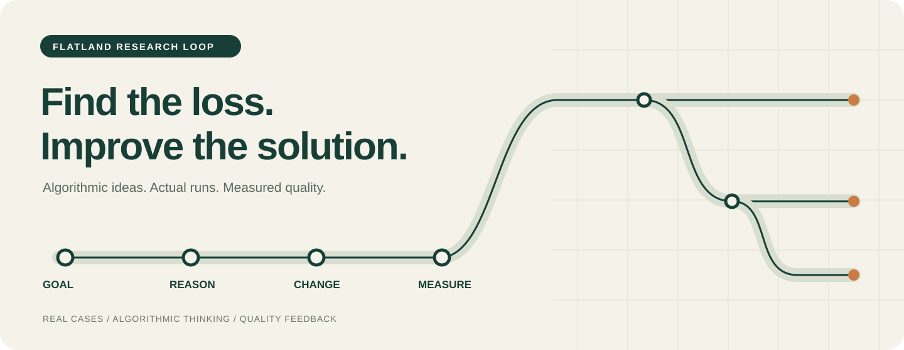

**简体中文** | [English](README.en.md)



# Flatland Research Loop

**Flatland 自动研究**

**Evidence-guided Flatland Optimization**

一套**由真实实验记录提炼的脱敏案例支持的自动 Flatland 优化工作流**，以通用 Markdown skill 形式提供给不同 AI agent。agent 从你的现成项目出发，在明确目标、约束和预算内审阅证据、提出改动、运行评测，并保留最好已验证版本。交互教练是你明确希望学习或问答时启用的可选模式。

*An agent-agnostic workflow for autonomous Flatland optimization, informed by anonymized cases from real experiments.*

介绍页、skill 正文及配套材料均提供中英两版。它们是同一份指南的两种语言，无需安装两套。agent 按你当前的语言偏好回应，也可以随时要求切换语言。仓库与 skill 标识统一为 `flatland-research-loop`；Loop 对应观察、假设、实验、验证与修正的研究循环。

## 适合什么时候使用

- 已有一个项目，希望 agent 在给定约束与预算内自动优化，并保留最好已验证版本。
- 有了运行结果，需要定位一次改善或退步究竟来自哪里。
- 计划看起来合理，实际执行却停住、晚到或反复修复。
- 新方法在简单起点上有效，加入完整系统后收益有限。
- 内部指标、完整执行结果与最终评价对不上。
- 想复盘一次研究：哪些判断有证据，哪些仍是假设，下一步是否值得投入。

提供自己的代码、日志、评测规则、目标和资源预算即可开始。agent 先读取已有材料，复用可核实的历史结果，只处理影响有效推进的关键缺失事项。

## 默认流程：自动优化

面对现成项目或明确的优化、实现、实验意图，默认进入自动研究流程。agent 直接开展证据审阅与有界实验；只有你明确希望学习、练习判断或进行问答时，才使用交互教练。

**复用既有证据 → 定位问题并修改 → 针对性冒烟 → 按证据保留、修正或回滚**

先核实目标、硬约束、评测规则和可用资源，复用已有有效结果，默认只对改动影响的路径做快速、针对性的短冒烟。预算是上限，不是消耗目标；不默认建立实验矩阵、做全量 A/B、扫描随机种子、重复基线或每轮完整评测。只有存在具体未解决问题，且结果会改变保留、修改或回滚的决策时，才扩大检查或实验。性能提升需要相关且可比的实际测量，冒烟通过只支持所检查范围内的结论。

将实际检查与结果绑定到版本，简记失败、超时、资源消耗、保留状态和证据范围；退步或违反约束时回滚本轮改动，并保留此前最好已验证版本。达到已验证的目标、触及预算上限，或已没有值得检验的可行假设时，汇总结果并停止。

在已授权的本地范围和预算内，agent 可以连续完成这些步骤，无需每轮等待使用者回答或重复批准。只追问无法从现有材料合理推断、且会阻止有效推进的关键缺失事项。

小改动由当前 agent 实施并简短自审。宿主支持真实多 agent 工具，且独立研究、审查或执行任务值得其上下文与协调成本时再分工，不默认每轮建立多个角色。协作依据实际产物与结果；单个 agent 的角色对话不构成独立审查。

这份 skill 提供 Markdown 工作流程。文件访问、命令执行、评测、agent 委派及其权限由宿主提供；它本身不是常驻程序，也不保证任何平台都能持续或后台运行。没有实际执行能力时，应说明限制和未完成项，不能把预期结果写成实验事实。详细流程见 [自动研究指南](references/autonomous-research.md)。

## 从真实实验中保留下来的案例

[脱敏实验案例](references/reasoning-cases.md) 按“尝试了什么 → 实际观察 → 如何决定下一步分支”组织。它们保留失败、有限收益与可继续检验的判断，不提供获胜模块配方，也不公开原始代码、参数或完整配置。

| 案例方向 | 实际观察与证据边界 | 在自己的项目中应检验什么 |
| --- | --- | --- |
| **C1 · 负结果：等成本横移与历史成本接受** | 等成本横移结果持平且更慢；历史成本接受确实产生了探索，但最终返回的最好解仍弱于对照，因此未集成。 | 分开记录当前解与最好解，在可比预算下比较最终返回结果及耗时；探索发生本身不构成收益。 |
| **C2 · 基线依赖：少量列车联合冲突搜索** | 小图结果与对照一致，弱起点上多数改善，成熟基线上的边际收益却很小；未凭这些结果集成。 | 对弱起点和成熟基线分别做配对比较，验证候选是否补充了当前系统缺少的能力。 |
| **C3 · 效率：增量维护预约／占用表** | 固定工作量下，路径、成本、随机状态和接受历史一致，耗时下降；候选也包含相关效率改动，不能全部归因于单项，更不能据此推导整局收益。 | 隔离增量维护这项改动，再分别验证固定工作量的一致性与效率、完整运行的实际收益。 |
| **C4 · 指标：搜索与紧迫性处理的真实评测** | 增加搜索和紧迫性处理后，使用者的两份实际评测表显示完成数、按时数和汇总代价改善，最终分数却下降，研究转向逐例检查；具体评分公式不能由此推定。 | 将每例结果绑定到版本和评测条件，核查评价规则及逐例变化，保留未查明的计分关系。 |
| **C5 · 执行：故障后扩大重排范围并按计划质量择优** | 经历收紧条件、重测和关闭回退；当时助手报告执行惩罚与耗时增加。此处依据为测试调用与测量摘要，并非原始运行输出；伴随其他改动，不能唯一归因。 | 在自己的小例中实际重放并记录执行结果，隔离重排范围与伴随改动，检验计划质量能否预测执行收益。 |
| **C6 · 覆盖：扩大候选起点范围** | 保存计划与完整执行出现有限改善，完成数和按时数不降，但耗时增加；覆盖变化与额外预算的作用没有因果分离。 | 分别设计控制预算或工作量的比较，区分覆盖本身的价值与投入更多计算带来的收益。 |

右列是用于当前项目的验证方向，不是对原始实验结果的补写。案例中的有限观察可以帮助选择实验；是否适用于你的环境，仍由实际运行与评测决定。

## 在你的 agent 中使用

核心内容是 Markdown，不依赖特定模型、API、插件或求解器。各平台是否自动发现 skill、放在哪个目录、怎样注册指令并不相同；下面的“读取指南”是通用方式，不表示克隆后会自动生效。

### 能读取文件的 agent

将仓库下载到你选定的目录，或执行：

```bash
git clone https://github.com/kidheart/flatland-research-loop.git
```

在该目录启动 agent，或把目录的实际路径提供给它，然后发送：

```text
请读取 flatland-research-loop 目录中的 SKILL.md，
将它作为本次 Flatland 自动优化的工作指南，按需读取它链接的参考材料。
请用中文回应。先利用我已提供的信息，
对现成项目或优化请求默认开展自动研究，并遵守项目约束和资源预算。
只有我明确要求学习或问答时，才切换为交互教练。
```

英文使用者读取 [SKILL.en.md](SKILL.en.md)，英文参考材料位于 `references/en/`。如果你的平台有原生 skill 或自定义指令功能，可以按它自己的文档注册这份指南；`$flatland-research-loop` 等调用语法并非所有平台通用。

### 只能对话或上传附件的 agent

上传或粘贴 [SKILL.md](SKILL.md) 的完整内容，并说明希望按此指南讨论 Flatland。需要案例、提问库或实验卡时，再提供对应文件。只发送文件名或链接不意味着 agent 能读取内容；无法读取时，应由它说明还缺少哪些材料。

这些说明提供可移植的使用方式，不代表已对每个模型或 agent 产品逐一验证；具体表现还取决于宿主的上下文长度、文件访问和工具能力。

<details>
<summary>可选：在 Codex 中安装为原生 skill</summary>

可以在 Codex 中输入：

```text
使用 $skill-installer，从 https://github.com/kidheart/flatland-research-loop
安装仓库根目录的 skill，名称为 flatland-research-loop。
如果同名安装目录已经存在，请先说明情况，不要覆盖。
```

也可以使用 PowerShell 克隆到 Codex 的用户级 skill 目录。以下命令会在目标目录已存在时停止：

```powershell
$skillPath = Join-Path $HOME '.agents/skills/flatland-research-loop'

if (Test-Path -LiteralPath $skillPath) {
    throw '目标目录已存在。请检查现有安装，不要直接覆盖。'
}

New-Item -ItemType Directory -Force -Path (Split-Path -Parent $skillPath) | Out-Null
git clone https://github.com/kidheart/flatland-research-loop.git "$skillPath"

if ($LASTEXITCODE -ne 0) {
    throw '克隆未完成。请检查 Git 输出和目标目录后再处理。'
}
```

安装后在新会话中使用 `$flatland-research-loop`；如果尚未发现它，重启 Codex。关于 skill 目录和安装方式，参见 [OpenAI 的 skill 文档](https://learn.chatgpt.com/docs/build-skills)。`agents/openai.yaml` 仅为这一可选适配提供展示信息，其他 agent 不需要读取它。

</details>

## 直接开始

加载指南后，用下面的提示词直接开展自动优化，并附上你有权使用的项目材料。提示词不依赖平台专属调用语法。

**自动优化：从现成项目和真实证据开始**

将下面的占位内容替换为实际路径与要求：

```text
请读取 <skill目录>/SKILL.md 和
<skill目录>/references/autonomous-research.md，以自动研究模式开展优化。
按需读取 <skill目录>/references/reasoning-cases.md，从相关脱敏案例中选择值得检验的假设。

我的项目路径：<项目实际路径>
目标：<要改善的主指标与停止条件>
硬约束：<正确性、接口、允许修改的范围及必须满足的限制>
资源预算：<总时长、最多实验轮数、计算资源或调用费用上限>

先审阅现有代码、规则、日志和可核实的历史结果，确认并保留当前最好已验证版本。
复用已有有效证据，做有界的小改动，默认只对受影响路径做快速、针对性的短冒烟，
再按证据继续、修改或回滚本轮改动。预算是上限，不是消耗目标。
不默认做实验矩阵、全量 A/B、随机种子扫描、重复基线或每轮完整评测。
只有具体未解决问题的结果会改变下一步决策时，才扩大检查或实验。
性能提升须有相关且可比的实际测量；冒烟通过不代表性能提高。
保留最好已验证版本，无需每轮等待我回答或重复批准。
若有真实多 agent 工具，可委派研究、审查与执行任务；
否则自行审查，并如实说明没有独立 agent 审查。
只询问无法从现有材料合理推断、且会阻止有效推进的关键缺失事项。
最终报告最佳版本、实际结果、失败或超时、资源使用和证据边界。
没有运行的内容请明确标注，达到停止条件或预算上限后停止。
```

## 可选：交互教练

只有明确希望学习或问答时才启用。每次围绕最关键的不确定性问一至两个问题，根据你的回答逐步给提示、共同设计实验。尚无项目材料时，可以使用明确标注的虚构小例；这类练习不算实际优化或评测。

<details>
<summary>展开学习提示词与虚构问答示例</summary>

**从一个研究问题开始**

```text
请按已加载的 Flatland Research Loop 指南，以交互教练模式开展讨论。
先阅读我提供的环境说明和实验记录，复述你已经知道的事实。
围绕当前最关键的不确定性，每次问我一至两个问题，
帮助我提出能被推翻的假设，并共同设计下一步实验。
```

**追查计划与执行的分歧**

```text
请按已加载的 Flatland Research Loop 指南，以交互教练模式开展讨论。
我提供了自己的计划轨迹、实际轨迹和动作接口说明。
请先找出第一次分歧，区分已知事实与可能解释，
再帮助我设计一个小检查来定位原因。
```

**判断一次改善说明了什么**

```text
请按已加载的 Flatland Research Loop 指南，以交互教练模式开展讨论。
请审视我提供的前后两次实验：它们是否从可比的起点开始，
使用了什么资源，实际完成了多少工作，失败或超时是否进入统计？
帮助我区分效率变化、策略变化和完整执行收益，并说清证据的边界。
```

**只有一个想法，还没有实验**

```text
请按已加载的 Flatland Research Loop 指南，以交互教练模式开展讨论。
我暂时没有运行数据。请用一个明确标注为虚构的铁路小例，
带我练习区分观察与解释，并设计能够区分两种解释的实验。
先让我表达判断；我卡住时再逐步给提示。
```

### 一段虚构的问答

> **以下仅演示可选的交互教练模式。它是虚构教学例，不对应真实实验结果，也不提供建议参数。**
>
> **使用者：** 我加了一个步骤，计划成本下降了，所以最终评价应该也会更好。
>
> **教练：** 这个成本是在计划生成后记录的，还是完整执行后记录的？你的评价规则直接使用它吗？
>
> **使用者：** 只是计划生成后。实际执行还有扰动，我还没核对评分规则。
>
> **教练：** 目前的证据支持“计划阶段改善”。你准备怎样检验，这个收益能否保留到执行结束？
>
> **使用者：** 从相同输入开始，对照运行到结束，分别记录计划、执行结果和实际资源消耗，再按已核实的规则比较。
>
> **教练：** 这能帮助区分几个层次。你会用什么结果决定修改原来的判断？

</details>

## 内容导航

| 文件 | 用途 |
| --- | --- |
| [中文 skill](SKILL.md) · [English skill](SKILL.en.md) | 研究指南入口：模式选择、工作流程、判断标准与资料边界。 |
| [自动研究指南](references/autonomous-research.md) · [English](references/en/autonomous-research.md) | 有界实验循环、agent 分工、真实评测与最佳版本保留。 |
| [提问与提示库](references/question-bank.md) · [English](references/en/question-bank.md) | 按目标、接口、实验、泛化和结果解释等困惑选择问题。 |
| [实验记录卡](references/experiment-card.md) · [English](references/en/experiment-card.md) | 记录预期、实际结果、反证条件及下一步选择。 |
| [脱敏实验案例](references/reasoning-cases.md) · [English](references/en/reasoning-cases.md) | 来自真实记录的尝试、实际观察、有限结论与下一步分支。 |
| [agents/openai.yaml](agents/openai.yaml) | 可选的 Codex 展示信息；通用使用不依赖此文件。 |
| [LICENSE](LICENSE) | 本仓库的许可条款。 |

## 研究结论的边界

Flatland 环境之间的版本、转移规则、速度、故障可见性、目标处理、评价方式和资源限制可能不同。每次讨论都应从使用者当前环境中与问题相关的条件出发。

脱敏案例保留定性观察与判断过程，未公开可独立复核的原始实验材料；它们用于启发假设，不能作为公开性能比较或最优性证据。案例的排列也不代表推荐架构或必须复走的研究路线。

可行性、达到既定目标、评价较好与理论最优，需要各自相应的证据。局部检查、本地结果与完整评测支持的结论范围也不同。本项目不承诺特定分数、满分或在所有环境中的最优性。

本仓库不包含来源项目的源码、精确配置、参数、逐例成绩或可重建其方案的实现细节。agent 仅使用当前使用者提供或授权访问的材料与公开资料，不主动从历史对话或私有工程中找回来源方案。

如果你的解释得到更强的证据支持，就应更新甚至推翻案例中的判断。达到自己定义并已验证的目标后，可以总结适用条件与未知事项，结束本轮研究。

## 贡献

欢迎通过 [Issue](https://github.com/kidheart/flatland-research-loop/issues) 讨论改进，或通过 [Pull Request](https://github.com/kidheart/flatland-research-loop/pulls) 提交：

- 能区分不同解释的提问，以及使用者卡住时有效的渐进提示。
- 明确标注的虚构教学例，或有权公开并充分脱敏的定性思考案例。
- 更清晰的实验记录方式、措辞修正与翻译。

新增案例请说明观察、可能解释、区分实验、有限结论，以及重新考虑的条件。检查多个案例放在一起时，是否可能暴露来源方案的独特组合。

请勿提交来源项目或他人的私有解法、代码、参数、配置、成绩、日志或提交标识。提交前请确认你有权公开该内容，并愿意让贡献按本仓库相同许可发布。

## 许可

© kidheart。本仓库采用 [Creative Commons Attribution–NonCommercial 4.0 International（CC BY-NC 4.0）](LICENSE)。你可以按许可进行非商业性的分享与改编，但须适当署名、提供许可链接、标明改动，并遵守其他许可条件。商业使用须另行取得许可。

可参考的署名：

> 基于 kidheart 的 [Flatland Research Loop](https://github.com/kidheart/flatland-research-loop)，采用 [CC BY-NC 4.0](https://creativecommons.org/licenses/by-nc/4.0/)；如有改动，请在此说明。
